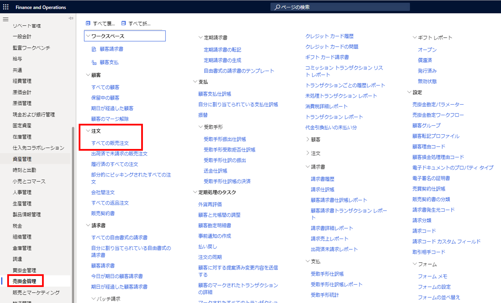
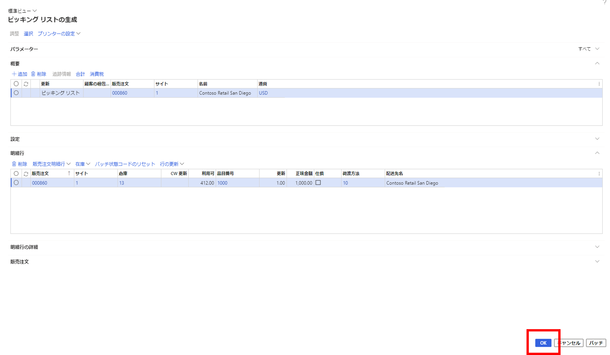
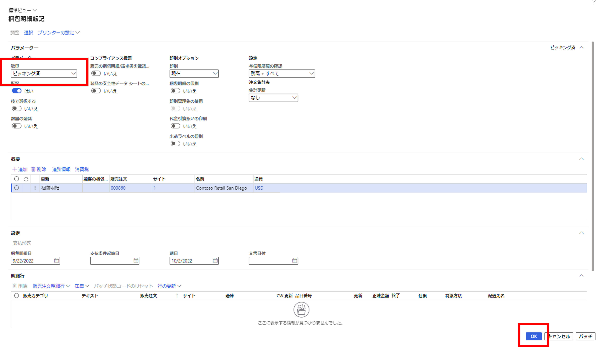
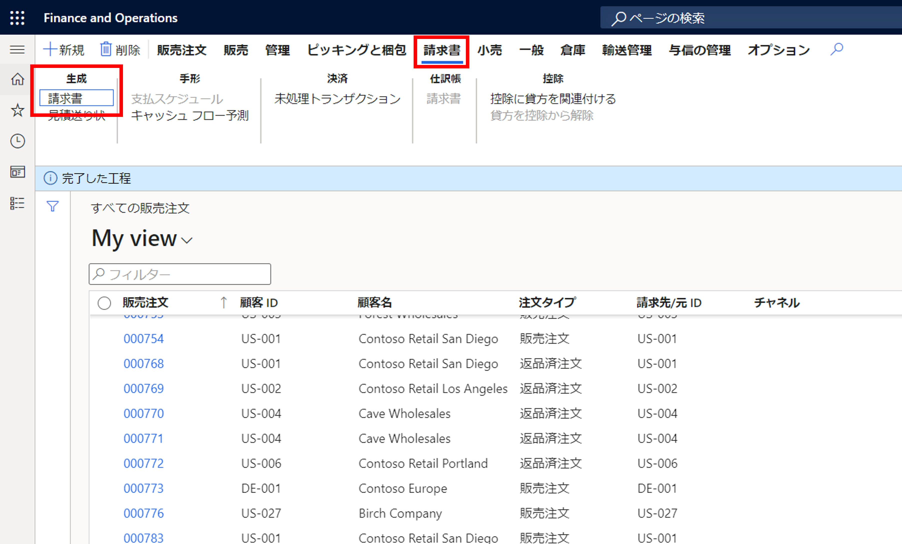

こんにちは、Dynamics ERP サポートチームの道浦です。  
この記事では、 Dynamics 365 Finance and Operations にて、 販売注文作成の一連の流れについて紹介します。

<!-- more -->
## 検証に用いた製品・バージョン
Dynamics 365 Finance and Operations      
Application version: 10.0.28    
Platform version: PU52  

## 販売注文作成の一連の流れ

1. 売掛金管理 > 注文 > すべての販売注文の順にクリックする  
    

2. 左上の「+ 新規」をクリックし、「顧客ID」を入力する
    設定が完了した後、OK ボタンをクリックする  
    ※顧客 ID を入力すると、「名前」以降は自動入力されます
    

3. 「購買注文明細行」に必要な項目を入力する  
    ※「品目番号」を入力すると、製品マスタに登録している内容は自動入力されます。
    

4. 左上の「保存」ボタンをクリックする  

5. 販売 > 生成 > 販売注文の確認の順にクリックし、販売注文の入力内容を確認し、 「 OK 」をクリックする
     
     

    ※ピッキングリストを作成する必要がない場合は、6, 7 番の手順はスキップします
6. ピッキングと梱包 > 生成 > ピッキングリストの生成の順にクリックする  
     

7. 入力内容を確認し、「 OK 」をクリックする
     

8. ピッキングと梱包 > 生成 > 梱包明細の転記を順にクリックする
     

9. 「パラメーター」の「数量」の箇所について、 6 番の手順を実施した場合は「ピッキング済み」、6 番の手順をスキップした場合は「すべて」に変更する。  

    < ピッキングリスト作成した場合 >  
       
    < ピッキングリストの作成をスキップした場合 >  
     

10. 請求書 > 生成 > 請求書の順にクリックする
    

11. 請求の転記する内容を確認して、「 OK 」をクリックする
    

12. 画面遷移後、画面右上のところに「請求済」が表示されます。  
    表示されれば販売注文が無事に作成されたことになります。
        

---
## おわりに  

以上、 Dynamics 365 Finance and Operations にて、販売注文作成の一連の流れについてご紹介しました。
より詳細な情報が必要な場合、弊社テクニカルサポート, Customer Success Account Manager (CSAM), Customer Engineer (CE) までお問い合わせください。
